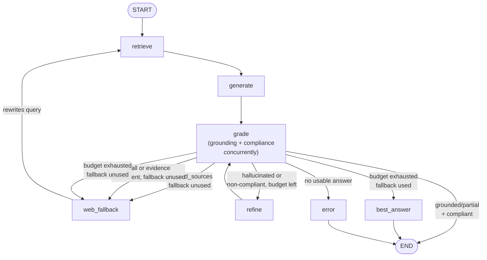

# SCRA – Self-Correcting Regulatory Agent v4.0

A compliance-aware regulatory Q&A agent with a self-auditing loop, engineered with Clean Architecture, dependency injection, and latency-aware self-correction. It answers questions about the **EU AI Act** (Regulation 2024/1689) using a retrieval-augmented generation pipeline that grades its own output for grounding and compliance before returning it to the user.

---

## Table of Contents

1. [Prerequisites](#prerequisites)
2. [Quick Start (Local)](#quick-start-local)
3. [Quick Start (Docker)](#quick-start-docker)
4. [Configuration Reference](#configuration-reference)
5. [API Endpoints](#api-endpoints)
6. [Querying the Agent](#querying-the-agent)
7. [Observability — Logs, Traces & Cost Tracking](#observability)
8. [Testing](#testing)
9. [Evaluation Harness](#evaluation-harness)
10. [Architecture](#architecture)
11. [Workflow](#workflow)
12. [Data Sources](#data-sources)
13. [Stack](#stack)
14. [Known Limitations](#known-limitations)
15. [Lessons Learned](#lessons-learned)

---

## Prerequisites

| Requirement | Notes |
|---|---|
| **Python 3.11+** | A conda environment is recommended |
| **API keys** | At least one LLM provider (Groq _or_ OpenAI), plus Cohere and Tavily |
| **Docker** _(optional)_ | Only needed for the containerised deployment path |

You will need the following API keys (all have free tiers):

| Service | Purpose | Get a key |
|---|---|---|
| **Groq** _or_ **OpenAI** | LLM generation + grading | [console.groq.com](https://console.groq.com) / [platform.openai.com](https://platform.openai.com) |
| **Cohere** | Reranking retrieved chunks | [dashboard.cohere.com](https://dashboard.cohere.com) |
| **Tavily** | Web search fallback | [tavily.com](https://tavily.com) |

---

## Quick Start (Local)

```bash
# 1. Create and activate a conda environment
conda create -n scra python=3.11 -y
conda activate scra

# 2. Install dependencies
pip install -r requirements.txt

# 3. Create your .env file from the example
cp .env.example .env
#    Edit .env and fill in your API keys (see Configuration Reference below).

# 4. If this is your first run, ingest the EU AI Act corpus
#    (this populates the ChromaDB vector store; takes ~30s)
python -c "import asyncio; from src.infrastructure.ingestion import IngestionPipeline; \
           from src.config.settings import Settings; from src.infrastructure.chroma_adapter import ChromaAdapter; \
           s=Settings(); p=IngestionPipeline(s); a=ChromaAdapter(s); \
           chunks=asyncio.run(p.run()); asyncio.run(a.add_documents(chunks)); print(f'Ingested {len(chunks)} chunks')"

# 5. Start the server
uvicorn src.main:create_app --factory --host 0.0.0.0 --port 8000 --reload

# 6. Verify the server is running
curl http://localhost:8000/health
# → {"status":"ok","chroma_ok":true,"doc_count":734}
```

### Using the API after startup

```bash
# Ingest via the API (alternative to step 4 — runs as a background task)
curl -X POST http://localhost:8000/ingest
# → {"status":"accepted","chunks_ingested":0,"task_id":"<uuid>"}

# Check ingestion progress
curl http://localhost:8000/ingest/<task_id>

# Ask a question
curl -s -X POST http://localhost:8000/query \
  -H "Content-Type: application/json" \
  -d '{"question": "What AI practices are prohibited under Article 5?"}' | python -m json.tool
```

---

## Quick Start (Docker)

```bash
# 1. Create your .env file
cp .env.example .env
#    Edit .env with your API keys.

# 2. Build and start the container
docker compose up --build -d

# 3. Verify the server is running
curl http://localhost:8000/health

# 4. Ingest the EU AI Act corpus
curl -X POST http://localhost:8000/ingest

# 5. Query
curl -s -X POST http://localhost:8000/query \
  -H "Content-Type: application/json" \
  -d '{"question": "What is the definition of an AI system?"}' | python -m json.tool

# View logs (JSON-formatted in Docker)
docker compose logs -f scra

# Stop the container
docker compose down
```

> **Tip:** ChromaDB data is persisted in a Docker volume (`chroma_data`). You only need to ingest once; the data survives `docker compose down` and restarts.

---

## Configuration Reference

All settings are loaded from environment variables or a `.env` file. See [.env.example](.env.example) for the full template.

### Required Settings

| Variable | Description | Example |
|---|---|---|
| `GROQ_API_KEY` | Groq API key (required if `LLM_PROVIDER=groq`) | `gsk_...` |
| `OPENAI_API_KEY` | OpenAI API key (required if `LLM_PROVIDER=openai`) | `sk-...` |
| `COHERE_API_KEY` | Cohere API key (reranking) | `...` |
| `TAVILY_API_KEY` | Tavily API key (web search fallback) | `tvly-...` |

### Optional Settings

| Variable | Default | Description |
|---|---|---|
| `LLM_PROVIDER` | `groq` | LLM backend: `groq` or `openai` |
| `GROQ_MODEL` | `llama-3.3-70b-versatile` | Groq model name |
| `GROQ_GRADING_MODEL` | _(same as GROQ_MODEL)_ | Separate model for grading tasks (if set) |
| `OPENAI_MODEL` | `gpt-4o-mini` | OpenAI model name |
| `GROQ_TEMPERATURE` / `OPENAI_TEMPERATURE` | `0.0` | LLM temperature |
| `GROQ_MAX_TOKENS` / `OPENAI_MAX_TOKENS` | `4096` | Maximum output tokens |
| `CHROMA_PERSIST_DIR` | `./chroma_data` | ChromaDB persistence directory |
| `CHROMA_COLLECTION_NAME` | `eu_ai_act` | ChromaDB collection name |
| `TOP_K_RETRIEVAL` | `25` | Number of chunks retrieved before reranking |
| `TOP_K_FINAL` | `5` | Number of chunks after reranking (fed to LLM) |
| `PRIMARY_SOURCE_BOOST` | `1.2` | Score multiplier for primary (non-web) sources |
| `LATENCY_BUDGET_SECONDS` | `10.0` | Max wall-clock time per request (middleware enforced) |
| `MAX_RETRIES` | `2` | Self-correction loop retries before web fallback |
| `RATE_LIMIT_RPM` | `30.0` | Per-client-IP request rate limit (requests/minute) |
| `RATE_LIMIT_BURST` | `10` | Token bucket burst size |
| `CACHE_MAX_SIZE` | `128` | Maximum number of cached query results |
| `CACHE_TTL_SECONDS` | `300` | Cache entry time-to-live (seconds) |
| `TOP_K_SIBLINGS` | `2` | Sibling chunks to expand per retrieved chunk (context window) |
| `CACHE_SIMILARITY_THRESHOLD` | `0.92` | Cosine similarity threshold for semantic cache hits |
| `OTEL_SERVICE_NAME` | `scra-agent` | OpenTelemetry service name |
| `OTEL_EXPORTER_ENDPOINT` | _(empty)_ | OTLP gRPC endpoint (e.g. `http://localhost:4317`) |
| `LOG_FORMAT` | `text` | Log format: `text` (human) or `json` (structured) |
| `LOG_LEVEL` | `INFO` | Log level: `DEBUG`, `INFO`, `WARNING`, `ERROR` |
| `LOG_FILE` | _(empty)_ | Optional path for a rotating log file (e.g. `logs/scra.log`) |
| `LANGFUSE_ENABLED` | `false` | Enable Langfuse LLM tracing (set to `true` with keys below) |
| `LANGFUSE_PUBLIC_KEY` | _(empty)_ | Langfuse project public key |
| `LANGFUSE_SECRET_KEY` | _(empty)_ | Langfuse project secret key |
| `LANGFUSE_HOST` | `https://cloud.langfuse.com` | Langfuse host URL |

---

## API Endpoints

| Method | Path | Description |
|---|---|---|
| `POST` | `/query` | Submit a regulatory question and receive a grounded, compliance-checked answer |
| `GET` | `/health` | Health check — returns ChromaDB connectivity and document count |
| `POST` | `/ingest` | Trigger background ingestion of the EU AI Act from EUR-Lex (returns `task_id`) |
| `GET` | `/ingest/{task_id}` | Poll the status of a background ingestion task |
| `GET` | `/stats` | Return LLM token usage, call counts, and cache size |
| `GET` | `/docs` | Interactive Swagger UI (auto-generated by FastAPI) |
| `GET` | `/redoc` | ReDoc API documentation |

### Interactive Documentation

Once the server is running, visit **http://localhost:8000/docs** for the Swagger UI where you can try all endpoints interactively.

---

## Querying the Agent

### Request

```bash
curl -s -X POST http://localhost:8000/query \
  -H "Content-Type: application/json" \
  -d '{"question": "What is the definition of an AI system in the EU AI Act?"}' | python -m json.tool
```

### Response Structure

```json
{
  "answer": "An AI system is a machine-based system designed to operate with varying levels of autonomy... [EUAI_Art3_Chunk0][EUAI_Rec12_Chunk1]",
  "grounding_score": "grounded",
  "compliance": {
    "is_compliant": true,
    "risk_flags": [],
    "reasoning": ["The answer accurately represents the legal definition..."]
  },
  "sources": ["EUAI_Art3_Chunk0", "EUAI_Rec12_Chunk1"],
  "latency_ms": 7356.9,
  "fallback_used": false
}
```

| Field | Description |
|---|---|
| `answer` | The generated answer with inline citations in `[SOURCE_ID]` format |
| `grounding_score` | `grounded`, `partial`, `hallucinated`, or `unknown` |
| `compliance` | Compliance analysis: `is_compliant`, `risk_flags`, and `reasoning` |
| `sources` | List of cited source IDs (e.g. `EUAI_Art5_Chunk0`, `WEB_...`) |
| `latency_ms` | Total processing time in milliseconds |
| `fallback_used` | Whether Tavily web search was used as a fallback |

### Example Questions

```
What AI practices are prohibited under Article 5?
What are high-risk AI systems according to the EU AI Act?
What is the definition of an AI system in the EU AI Act?
What obligations do providers of high-risk AI systems have?
What are the transparency requirements for AI systems?
Is biometric categorisation allowed under the EU AI Act?
What is the role of the European AI Office?
What penalties exist for non-compliance with the EU AI Act?
```

### PowerShell (Windows)

```powershell
$body = @{ question = "What AI practices are prohibited under Article 5?" } | ConvertTo-Json
Invoke-RestMethod -Uri "http://localhost:8000/query" -Method Post -ContentType "application/json" -Body $body | ConvertTo-Json -Depth 5
```

---

## Observability

### Logging

Logs go to stdout in either human-readable or structured JSON format.

```bash
# Human-readable (default)
LOG_FORMAT=text LOG_LEVEL=INFO uvicorn src.main:create_app --factory

# Structured JSON (recommended for production / Docker)
LOG_FORMAT=json LOG_LEVEL=INFO uvicorn src.main:create_app --factory
```

Set `LOG_LEVEL=DEBUG` to see:
- Detailed retrieval and reranking results
- Grading/compliance verdicts
- LLM prompt/completion audit logs (via the `scra.llm_audit` logger)
- Rate limiter bucket eviction events
- Cache hit/miss decisions

### LLM Audit Logging

All LLM interactions (prompts and completions) are logged to a dedicated `scra.llm_audit` logger at `DEBUG` level. To capture these to a file:

```python
# In your logging config or .env:
LOG_LEVEL=DEBUG
```

They appear in the standard log output with the `scra.llm_audit` logger name.

### Token Usage & Cost Tracking

The `/stats` endpoint returns cumulative LLM usage since server start:

```bash
curl -s http://localhost:8000/stats | python -m json.tool
```

```json
{
  "llm_usage": {
    "total_calls": 30,
    "total_prompt_tokens": 298,
    "total_completion_tokens": 104,
    "total_tokens": 402
  },
  "grading_usage": "(same as llm_adapter)",
  "cache_size": 2
}
```

- `total_calls` — number of LLM API invocations
- `total_prompt_tokens` / `total_completion_tokens` — cumulative token counts (from LLM response metadata)
- `cache_size` — number of currently cached query results
- If `GROQ_GRADING_MODEL` is set, `grading_usage` shows separate stats for the grading adapter

> **Estimating cost:** Multiply token counts by your provider's per-token pricing. For Groq free tier, the primary concern is rate limits rather than cost.

### OpenTelemetry Tracing

Distributed tracing is built in via OpenTelemetry. By default, spans are printed to the console.

**To export traces to Jaeger, Zipkin, or any OTLP-compatible backend:**

```bash
# Install the OTLP exporter (not included in base requirements)
pip install opentelemetry-exporter-otlp-proto-grpc

# Set the endpoint in .env
OTEL_EXPORTER_ENDPOINT=http://localhost:4317
```

**Running Jaeger locally (Docker):**

```bash
docker run -d --name jaeger \
  -p 16686:16686 \
  -p 4317:4317 \
  jaegertracing/all-in-one:latest

# Then set OTEL_EXPORTER_ENDPOINT=http://localhost:4317 in your .env
# View traces at http://localhost:16686
```

All FastAPI endpoints are automatically instrumented. Traces include:
- HTTP request spans (method, path, status code, latency)
- Internal spans from the LangGraph workflow nodes

### Langfuse LLM Tracing (Optional)

[Langfuse](https://langfuse.com) provides per-call LLM tracing with token counts, latencies, and full prompt/completion visibility for every LangGraph node execution.

**To enable:**

```bash
# .env
LANGFUSE_ENABLED=true
LANGFUSE_PUBLIC_KEY=pk-lf-...
LANGFUSE_SECRET_KEY=sk-lf-...
# LANGFUSE_HOST=https://cloud.langfuse.com  # default; override for self-hosted
```

When enabled, every `ainvoke` call on the compiled workflow automatically records a full trace in the Langfuse dashboard. Install the package if not already present:

```bash
pip install langfuse
```

When `LANGFUSE_ENABLED=false` (the default) or keys are missing, the feature is silently skipped — no errors, no performance impact.

---

## Testing

### Running Tests

```bash
# All unit tests (no API keys needed, ~12s)
pytest tests/ -v --tb=short

# Quick summary
pytest tests/ -q

# With coverage report
pytest tests/ -v --cov=src --cov-report=term-missing
```

### Test Suite Overview

| File | Tests | What it covers |
|---|---|---|
| `test_domain_models.py` | 32 | Pydantic models, `EvidenceChunk` validation, citation regex, `GraphState` |
| `test_citation_service.py` | 12 | Inline citation extraction, structured + legacy validation |
| `test_grading_service.py` | 15 | Grounding + compliance grading, structured output, JSON fallback |
| `test_retriever_service.py` | 4 | Retrieval flow, reranking, web fallback, primary source boost |
| `test_workflow.py` | 42 | Decision routing, quality ranking, stall detection, evidence insufficiency |
| `test_api.py` | 8 | FastAPI endpoints (`/query`, `/health`, `/stats`), cache integration |
| `test_cache.py` | 10 | `QueryCache` LRU + TTL + semantic similarity, case normalisation, eviction |
| `test_chunking.py` | 19 | Fixed-size + paragraph splitting, metadata prepend, edge cases |
| `test_rate_limit.py` | 7 | Token bucket, TTL eviction, interval guard |
| `test_eval_scoring.py` | 14 | Evaluation metric scoring (relevance, citations, sources) |
| `test_infrastructure.py` | — | Unit tests for infrastructure adapters (Groq, OpenAI, Cohere, Chroma, Tavily) |
| `test_integration.py` | 3 | Live smoke tests (Groq, Cohere, Tavily) — **skipped without API keys** |

### Integration Tests

To run the live integration tests (requires valid API keys in `.env`):

```bash
RUN_LIVE_TESTS=1 pytest tests/test_integration.py -v
```

These make real API calls to Groq/OpenAI, Cohere, and Tavily and are skipped by default.

---

## Evaluation Harness

The evaluation harness scores the agent's answers against a curated golden dataset of 25 EU AI Act questions. It requires a **running server**.

### Running an Evaluation

```bash
# 1. Start the server (in a separate terminal)
uvicorn src.main:create_app --factory --host 0.0.0.0 --port 8000

# 2. Run the eval suite
python -m evals.run_eval --url http://localhost:8000

# With pacing (for Cohere trial key rate limits)
python -m evals.run_eval --url http://localhost:8000 --delay 10

# Label the run with the model used
python -m evals.run_eval --model "llama-3.3-70b-versatile"

# Save results to a file
python -m evals.run_eval --output evals/results/run_2026-02-17.json
```

### Metrics

Each question is scored on:

| Metric | Description |
|---|---|
| `answer_relevance` | % of expected keywords found in the answer |
| `citation_valid` | All inline citations match the allowed format |
| `citation_sourced` | Citations reference the expected article/recital |
| `grounding_pass` | `grounding_score == "grounded"` |
| `compliance_pass` | `is_compliant == True` |
| `latency_ms` | End-to-end response time |
| `no_fallback` | Answered from primary corpus (no web search) |

Aggregate metrics: `pass_rate`, `mean_relevance`, `grounding_rate`, `compliance_rate`, `citation_rate`, `fallback_rate`, `mean_latency`.

### Benchmark Results

> **Note on "accuracy":** The eval harness does not implement binary correct/incorrect scoring. The closest proxy is `answer_relevance` — the fraction of expected keywords found in the answer (range 0–1). All runs used the default `fixed_2000` chunking strategy. No end-to-end accuracy comparison across chunking strategies was measured; see the retrieval-only benchmark below for quality differences between chunk configs.

#### Model comparison — end-to-end eval (Feb 2026, chunking: `fixed_2000`)

| Metric | Groq / Maverick _(n=10)_ | OpenAI `gpt-4o-mini` _(n=25)_ |
|---|---|---|
| **Answer relevance** _(accuracy proxy)_ | 59% | **69%** |
| Pass rate | 70% | **72%** |
| Grounding rate | **100%** | 96% |
| Compliance rate | **100%** | 96% |
| Citation validity | **90%** | 88% |
| Citation source accuracy | **70%** | 56% |
| Web fallback rate | **0%** | 20% |
| p50 latency | 41,087 ms | **9,604 ms** |
| p95 latency | 126,666 ms | **66,090 ms** |
| p50 latency (no-fallback) | 41,087 ms | **8,135 ms** |
| p95 latency (no-fallback) | 126,666 ms | **44,381 ms** |

**Takeaways:**
- **OpenAI `gpt-4o-mini` wins on answer relevance (69% vs 59%) and is ~5× faster** (p50 8 s vs 41 s). The higher p50 on Groq/Maverick reflects that model's slower token generation throughput, not retry depth — Maverick had 0% fallback rate, so no retries occurred. The self-correction loop compounds this: each retry adds another full LLM round-trip + Cohere rerank. Single-pass queries cluster at 6–13 s; the gap widens when retries kick in.
- **Groq/Maverick wins on citation source accuracy (70% vs 56%)** — it more reliably cites the expected article/recital, which matters for legal Q&A.
- Grounding and compliance are perfect for Groq/Maverick vs. 96% for OpenAI, but the Groq sample is smaller (10 vs 25 questions).
- The Groq run filename is labelled `maverick`; the model field was not captured in the result file (likely `llama-3.3-70b-versatile` or a preview model — see `GROQ_MODEL` in your `.env`).
- The `LATENCY_BUDGET_SECONDS` middleware default is intentionally set above the single-pass p50 to let the self-correction loop complete on most queries; lower it for latency-sensitive deployments where a partial answer beats a timeout.

#### Retrieval-only benchmark — 8 chunking configs, 25-question test set, embeddings: `all-MiniLM-L6-v2` via ChromaDB (Feb 2026)

| Config | Split mode | Max chars | recall@5 | recall@10 | recall@25 | hit@1 |
|---|---|---|---|---|---|---|
| **fixed_2000** _(winner)_ | fixed | 2000 | **41.8%** | **61.6%** | **82.6%** | **100%** |
| para_2000 | paragraph | 2000 | 41.8% | 61.6% | 82.6% | 100% |
| fixed_1200 | fixed | 1200 | 39.8% | 57.7% | 81.9% | 95.8% |
| para_1200 | paragraph | 1200 | 39.8% | 57.1% | 81.0% | 95.8% |
| fixed_800 | fixed | 800 | 36.5% | 51.8% | 76.8% | 87.5% |

> `para_2000` ties `fixed_2000` across all retrieval metrics — EU AI Act article boundaries align naturally with ~2000-char paragraph splits. Smaller chunks (≤1200 chars) degrade quality for both split modes. Note: latency is not affected by chunking strategy — it is driven entirely by LLM and reranker round-trips.

### Comparing Runs

```bash
python -m evals.compare_runs evals/results/baseline.json evals/results/new.json
```

This produces a regression report showing deltas for each metric with ✅/❌ indicators.

### Golden Dataset

The golden dataset lives at [evals/golden_dataset.json](evals/golden_dataset.json). Each entry has:

```json
{
  "id": "eval_001",
  "question": "Is social scoring allowed under the EU AI Act?",
  "expected_answer_contains": ["prohibited", "Article 5"],
  "expected_source_type": "primary_legal",
  "expected_citation_pattern": "EUAI_Art5",
  "topic": "prohibited_practices",
  "difficulty": "easy"
}
```

---

## Architecture

```
src/
├── domain/          # Pure Python + Pydantic V2 models, protocols, exceptions
│   ├── models.py    # EvidenceChunk, GraphState, ComplianceAnalysis, etc.
│   ├── protocols.py # LLMPort, RetrieverPort, RerankerPort, WebSearchPort, VectorStorePort
│   └── exceptions.py
├── application/     # Business logic (depends only on domain)
│   ├── workflow.py  # LangGraph self-correcting agent loop
│   ├── prompts.py   # Central prompt templates
│   ├── cache.py     # LRU response cache with TTL + semantic similarity
│   └── services/
│       ├── retriever_service.py   # Retrieve + rerank + source-priority boost
│       ├── citation_service.py    # Citation contract validation
│       ├── grading_service.py     # Grounding + compliance grading
│       ├── generation_service.py  # RAG prompt building + injection sanitisation
│       └── evidence_builder.py    # Shared evidence block builder for LLM prompts
├── infrastructure/  # External adapters (implements domain protocols)
│   ├── base_llm_adapter.py  # Shared base: structured output cache, token tracking, audit log
│   ├── groq_adapter.py      # Groq/Llama (LLMPort)
│   ├── openai_adapter.py    # OpenAI (LLMPort)
│   ├── cohere_adapter.py    # Cohere rerank v3.5 (RerankerPort)
│   ├── chroma_adapter.py    # ChromaDB (RetrieverPort + VectorStorePort)
│   ├── tavily_adapter.py    # Tavily web search (WebSearchPort)
│   ├── ingestion.py         # EUR-Lex HTML → EvidenceChunk pipeline
│   └── telemetry.py         # OpenTelemetry + Langfuse + structured logging
├── presentation/
│   ├── api.py         # FastAPI endpoints + cache + background ingestion
│   ├── middleware.py  # Latency budget ASGI middleware
│   └── rate_limit.py  # Per-IP token bucket rate limiter
├── config/
│   └── settings.py    # Pydantic Settings from .env
├── container.py       # DI composition root
└── main.py            # Entry point (uvicorn --factory mode)
```

### Key Design Decisions

- **Clean Architecture**: Domain layer has zero external dependencies. Infrastructure adapters implement domain protocols.
- **Dependency Injection**: `container.py` wires everything via `cached_property` — lazy-init, no globals.
- **Self-Correction Loop**: If the LLM output is hallucinated or non-compliant, the agent rewrites the question and retries (up to `MAX_RETRIES`), then falls back to web search.
- **Structured Output**: Grading uses `with_structured_output()` for reliable JSON, with regex fallback for models that don't support it.
- **Rate Limiting**: Per-IP token bucket at the ASGI layer with TTL-based bucket eviction to prevent memory leaks.
- **Response Cache**: LRU cache with SHA-256 exact-match fast path **and** semantic similarity fallback (ONNX MiniLM embeddings, zero API calls). Normalises case and whitespace to improve hit rates.

---

## Workflow



Text summary:

```
retrieve → generate → grade (grounding + compliance concurrently) → [decide]
  ├─ (grounded | partial) + compliant → END
  ├─ no cited_sources → web_fallback¹ (or best_answer / error)
  ├─ stall: quality didn't improve → web_fallback¹ (or best_answer)
  ├─ evidence insufficient → web_fallback¹ (or refine if already on web)
  ├─ hallucinated / non-compliant + budget remaining → refine → grade (loop)
  ├─ budget exhausted, fallback unused → web_fallback¹
  └─ budget exhausted, fallback used → best_answer² (or error)

  ¹ web_fallback: rewrites query for better retrieval, then → retrieve
  ² best_answer: returns the highest-quality answer seen across all attempts
```

---

## Data Sources

- **Primary corpus**: Regulation (EU) 2024/1689 (EU AI Act) from EUR-Lex
- **Format**: HTML (structured by Articles, Recitals, Annexes)
- **Embeddings**: ChromaDB's default `all-MiniLM-L6-v2` (local, no API calls)
- **Fallback**: Tavily web search (`web_fallback` source type)

See [docs/compliance_matrix.md](docs/compliance_matrix.md) for the full compliance and feature matrix.

---

## Stack

| Component | Technology |
|---|---|
| LLM | Groq (Llama 3.3 70B) or OpenAI (configurable via `LLM_PROVIDER`) |
| Reranking | Cohere rerank-v3.5 |
| Vector DB | ChromaDB (local, `all-MiniLM-L6-v2` embeddings) |
| Web Fallback | Tavily |
| Workflow | LangGraph (self-correcting agent loop) |
| API | FastAPI + uvicorn |
| Observability | OpenTelemetry (OTLP export), structured logging |
| Runtime | Python 3.11+, Docker (optional) |

---

## Known Limitations

The following are acknowledged gaps, documented here for transparency. They represent areas for future improvement rather than oversights.

### Streaming

No SSE/WebSocket streaming support. For an LLM-powered API, streaming is standard UX for long-running generation. The current implementation returns the full response only after the entire self-correction loop completes (potentially 3+ LLM round-trips). Adding streaming would require rearchitecting the LangGraph workflow to emit partial tokens, which conflicts with the grounding/compliance validation that runs _after_ generation.

### Distributed / Production Caching

The current response cache (`QueryCache`) runs in-process with both exact-match (SHA-256) and semantic similarity (ONNX MiniLM cosine threshold). This handles paraphrased questions without API calls. However, the cache is not shared across workers or container replicas. A production deployment with multiple uvicorn workers should migrate to a shared cache backend (e.g. Redis + vector similarity) for cross-process hit rates.

### Embedding Model Selection

ChromaDB uses its default embedding model (`all-MiniLM-L6-v2`). This is arguably the most impactful RAG decision — a domain-tuned legal embedding model (e.g. `BAAI/bge-large-en-v1.5`, `intfloat/e5-large-v2`) would significantly improve retrieval quality for regulatory text. This was deferred to keep the dependency footprint minimal and avoid GPU requirements.

### Vector Store Versioning / Rollback

Re-ingestion overwrites the existing ChromaDB collection. There is no versioning, snapshotting, or rollback mechanism. A production system should support corpus version tagging so that a bad ingestion can be rolled back without data loss.

### Output Guardrails

Beyond the regex-based prompt injection filter (which is defense-in-depth, not a security boundary), there are no output guardrails. The LLM could theoretically generate misleading legal advice. Mitigations in place:
- A legal disclaimer is appended to every response.
- Grounding validation rejects hallucinated output.
- Compliance grading flags risk issues.

However, a dedicated output content filter (e.g. Azure Content Safety, Guardrails AI) would provide stronger protection for production use.

### Chunking Strategy

Chunks use a fixed 2000-character limit split on paragraph boundaries with 200-character overlap. This is a reasonable baseline but not optimal:
- No semantic chunking (splitting on topic boundaries).
- No recursive text splitting (LangChain `RecursiveCharacterTextSplitter`).
- The overlap helps but doesn't fully solve context loss at boundaries.

For legal text where article structure matters, a section-aware chunker would be more appropriate.

### LLM Audit Logging

LLM prompt/completion pairs are logged via a dedicated `scra.llm_audit` logger at DEBUG level. In production, this logger should be configured to write to a separate audit log file or log aggregator for compliance audit trails. The current setup logs to the standard logging infrastructure, which may not meet regulatory audit requirements without additional configuration.

### Background Ingestion State (Multi-Worker)

The `/ingest` endpoint tracks task status in an in-memory dict within the process. With multiple uvicorn workers (`--workers N`) or container replicas, a `task_id` issued by one worker will not be visible to another. For multi-process deployments, replace `_ingest_status` with Redis or a shared database. Single-worker deployments (the default) are unaffected.

---

## Lessons Learned

**Port mismatch caused 80% 500-errors on the first eval run.**
The server was started on port 8001 but the evaluation harness targeted the default port 8000. Eight of ten questions in the initial run hit connection-refused errors and were scored as failures (0% pass rate). Adding an explicit `--url http://localhost:8001` flag resolved this — the follow-up runs on the same day achieved 0% error rate and 72% pass rate.

**Metadata prepend hurt retrieval quality.**
Early chunking experiments prepended article metadata (e.g., `Article 5 | Chapter 2`) to each chunk, expecting the structured header to improve cosine similarity. In practice it reduced recall@5 by ~4 pp across both fixed and paragraph split modes (ranks 5–7 in the benchmark vs. ranks 1–2 without metadata). The metadata bloat crowded out substantive content in the chunk embedding, pushing relevant text below the retrieval cutoff. Reverting to clean-text chunks recovered the quality.

**Self-correction latency is dominated by retry depth, not generation.**
Profiling the eval traces showed that 90%+ of p95 latency came from LangGraph cycling through 2–3 correction retries, each requiring a full LLM round-trip plus Cohere rerank. Single-pass queries cluster around 6–13 s; once fallback or retries kick in, latency jumps to 40–80 s. The `LATENCY_BUDGET_SECONDS` ASGI middleware provides a configurable hard ceiling that prevents indefinite retry chains in production.

**In-process cache breaks under multiple workers.**
Running the evaluation server with `--workers 2` caused cache hit rates to drop to near-zero — each uvicorn worker maintains its own `QueryCache` with no shared state. Switching back to single-worker mode (the default) restored expected hit rates. This is now documented in Known Limitations with a Redis migration path noted.
